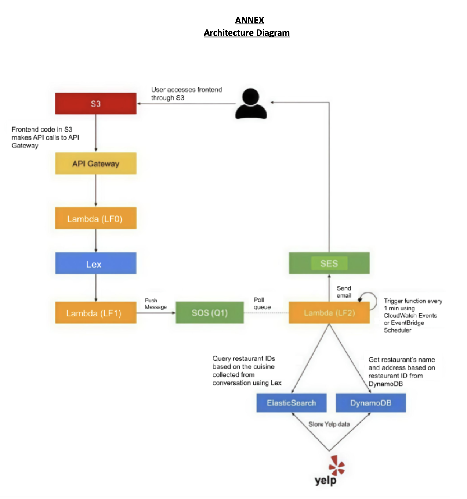

# 🍽️ Dining Concierge Chatbot System

## 📖 Overview
This project implements a **Dining Concierge Chatbot** that recommends restaurants based on user preferences using multiple **AWS serverless components**.  
It demonstrates end-to-end integration between **Lex, Lambda (LF0–LF2), SQS, DynamoDB, OpenSearch, and SES**, forming a robust event-driven architecture.

---

## 🏗️ System Architecture
The following diagram illustrates the overall data flow and component interactions:

---

## ⚙️ Components

### 🧩 **LF0 – API Gateway / Lex Interface**
- Serves as the **entry point** for the chatbot interface (usually through an API Gateway).
- Handles HTTP requests from the **frontend (S3-hosted website)**.
- Invokes **Amazon Lex V2** to process user messages and intents.

### 🧠 **Amazon Lex V2**
- Captures user inputs, intents, and slot values (e.g., cuisine, location, number of people, date, time, email).
- Passes validated input to LF1 for fulfillment.

### ⚙️ **LF1 – Lex Fulfillment Lambda**
- Validates user inputs and confirms slot values.
- On valid input, packages the request (JSON payload) and sends it to the **Amazon SQS queue** for asynchronous processing.

### 📬 **Amazon SQS**
- Acts as a **buffer** between LF1 and LF2, decoupling user requests from backend processing.
- Ensures scalability and fault tolerance.

### 🔁 **LF2 – Queue Worker Lambda**
- Triggered periodically by **Amazon EventBridge (or CloudWatch)**.
- Reads messages from SQS.
- Queries **OpenSearch** for restaurant data.
- Stores processed results in **DynamoDB** and sends recommendations to users via **SES**.

### 🔍 **Amazon OpenSearch Service**
- Stores indexed restaurant data for fast text-based and location-based queries.

### 🗄️ **Amazon DynamoDB**
- Stores processed query results, email metadata, and user interaction logs.

### 📧 **Amazon SES (Simple Email Service)**
- Sends restaurant recommendation emails to users based on processed results.

---

## 🚀 Data Flow Summary
1. User interacts with the chatbot UI hosted on **S3**, which calls **LF0** via **API Gateway**.  
2. LF0 communicates with **Lex V2**, which identifies user intent and slots.  
3. **LF1** validates input and places a structured request into **SQS**.  
4. **LF2** (triggered by EventBridge) processes the queue, queries **OpenSearch**, stores results in **DynamoDB**, and sends an email through **SES**.  
5. User receives personalized restaurant suggestions in their inbox.

---
